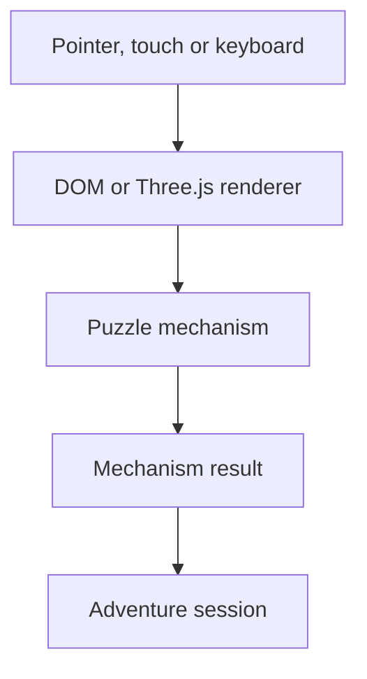

# ARE Technical Architecture

## Design vocabulary

ARE uses **module**, **interface**, **depth**, **seam**, **adapter**, **leverage** and **locality** as its shared design vocabulary.

- A deep module hides meaningful decisions behind a small interface.
- The interface is the test surface.
- A seam needs evidence: one adapter is hypothetical; two adapters make it real.
- The deletion test detects shallow modules: removing one should concentrate complexity, not merely move it.
- Locality keeps rules, transitions and their tests close enough to understand without file hopping.
- Leverage measures how many Adventures or renderers benefit from one safe change.

## Runtime ownership

`AdventureSession` is the single owner of cross-mechanism progress, inventory, current Scene and completion. It is a deep module: its interface is `getSnapshot`, `subscribe`, `send`, `reset` and `destroy`; event ordering, deduplication and completion rules remain inside.

Puzzle mechanisms own deterministic local transitions. Renderers own presentation-only state. A renderer publishes `active`, `error` or `solved` to the Adventure session and never duplicates global facts.



## Renderer seam

DOM and Three.js renderers are two adapters over the same mechanism interface. This is a real seam. Spatial renderers use React Three Fiber; DOM renderers use React and StyleX. Each essential spatial interaction has a touch-friendly, keyboard-accessible DOM path where practical.

The engine currently exposes refined Keypad and Dial artifacts plus Signal Tuner, Lever Console and Cipher Rotor artifacts. Metal layers, screws, bezels, status lamps, emissive feedback and semantic materials make their affordances diegetic without making animation the only status carrier.

## Theme translation

Theme is a typed semantic module. Three explicit adapters translate it:

| Adapter | Consumer | Output |
|---|---|---|
| `toObjectThemeStyle` | reusable DOM renderer | `--object-*` variables |
| `toLabThemeStyle` | Lab harness | `--are-*` variables |
| `toThreeTheme` | Three.js renderer | material palette |

This preserves locality: theme fallback and translation rules live in one module, while each renderer only consumes semantic values.

The built-in registry exposes Cyan, Amber and Stranger Things presets. Color and material tokens reach both renderer adapters, while optional typography and atmosphere tokens deepen DOM presentation without forcing existing Adventure themes to redefine the extended contract.

## Lab harness

The Lab harness owns route navigation, theme choice, reduced-motion mode, reset, event history and Adventure session telemetry. Each `/lab/<mechanism>/` module owns only its Artifact, operation, known solution, hint ladder, renderer and fallback controls.

Routes are lazy. The overview interface is roughly 70 kB gzip; the spatial rendering seam is fetched only when opened. The build writes a physical `index.html` for each route so direct GitHub Pages navigation remains functional.

## Adventure assembly

An Adventure is a workspace package with a validated `adventure.json`. The build module:

1. validates identity and route safety;
2. invokes the declared package build;
3. copies the real output into `dist/<id>/`;
4. validates relative asset references;
5. generates the root catalog from manifest metadata.

`Echo Station` is the integration proof. It composes a local Scenario, local Theme, specialized Signal Archive renderer, Adventure session, Dialogue, Signal Tuner and Cipher Rotor. Its spatial scenes are lazy so narrative content renders before Three.js downloads.

## Verification

- Vitest tests mechanism interfaces, Adventure session invariants, theme adapters, route parsing and build validation.
- React Testing Library tests semantic DOM behavior through the rendered interface.
- Playwright verifies direct routes, session continuity, mobile overflow, DOM fallbacks and the complete Echo Station journey.
- CI installs from the committed pnpm lockfile, runs lint/typecheck/tests/build, then runs Chromium regression before Pages deployment.

The deterministic baseline fixes Node, pnpm and dependency versions. WebGL canvases cap device pixel ratio at 1.5 to protect mobile fill rate, while controls remain usable at 390 px and desktop widths.

## Module map

```text
engine/
  core/          typed events and module contracts
  mechanisms/    deterministic puzzle rules
  session/       cross-mechanism Adventure state
  components/    DOM and Three.js renderers
  runtime/       sequential Scene runtime
lab/
  harness/       shared Lab interface
  routes/        lazy mechanism modules
adventures/
  echo-station/  first complete Adventure assembly
scripts/
  build-lib.mjs  manifest discovery and artifact assembly
```

Accepted decisions are recorded in `docs/adr/` and are not re-litigated without observed friction.
